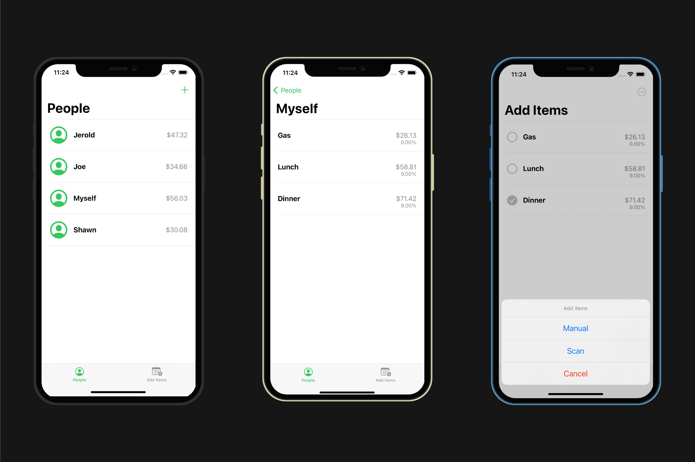

# Split the Bill

Automatically extract items in the receipt and calculate the splitting price.

# Things I Learned

-   Configure `Many to Many` relationships in `Core Data`.
-   Use `VNRecognizeTextRequest` from `Vision` framework.
-   Use `VNDocumentCameraViewController` from `VisionKit` framework.

# Technologies Used

-   Vision, VisionKit
-   Core Data
-   UiKit
-   Singleton, Factory, MVC

# Screenshot

